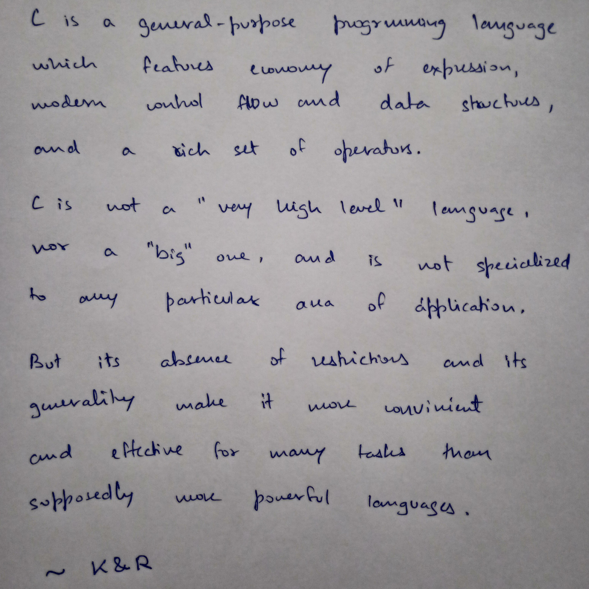
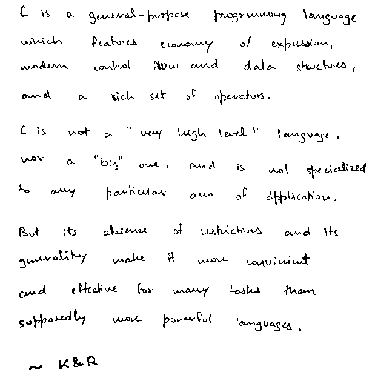

### CRISP

- Convert written document pictures into crisp scans of black/white pixels
- Resolution reduction feature saves considerable amount of memory

Compile:
```bash
$ cc crisp.c -lm
```

Use:
```bash
$ ./a.out greyval resredfactor image1 image2...
```

See first comment of src/crisp.c for more details on usage and stuff...

Crispy:
- example/ contains input and output images
- 200 times reduction in file size

Input:


Output:

